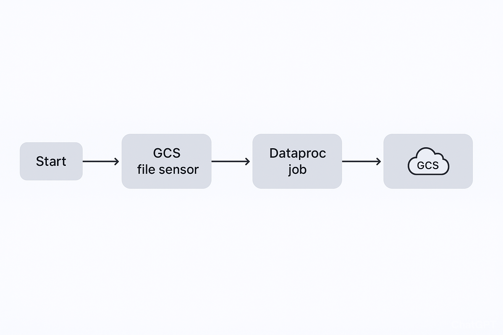
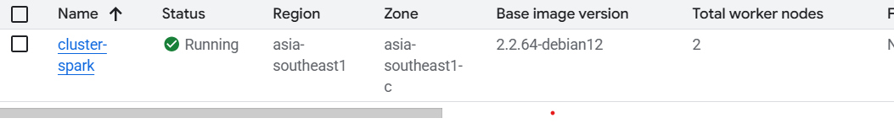
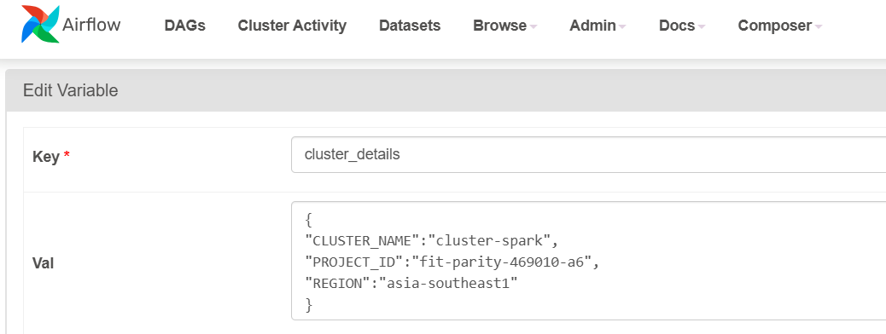
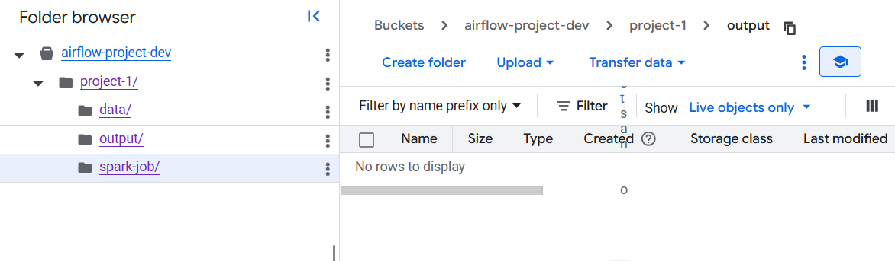
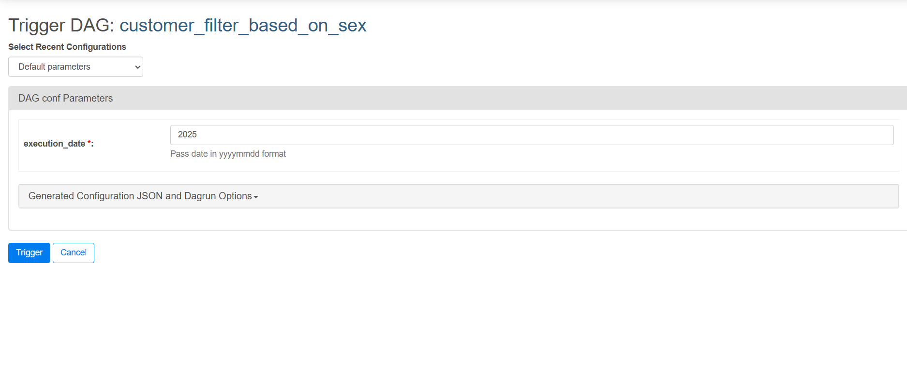
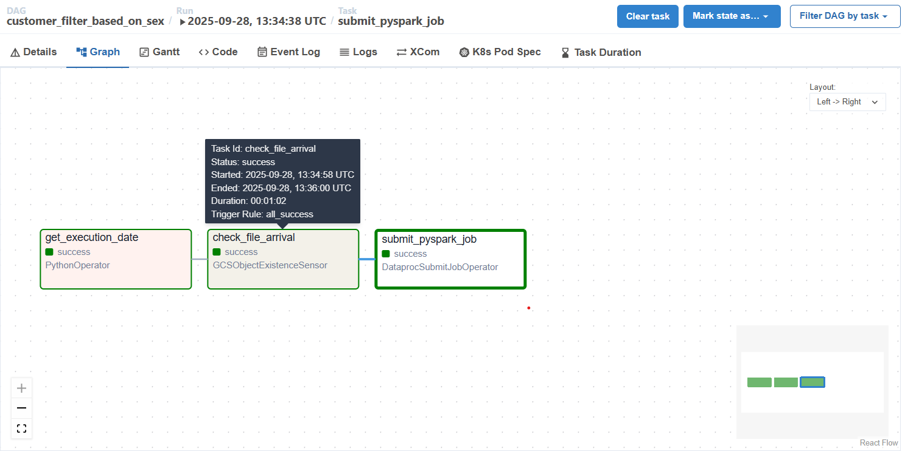
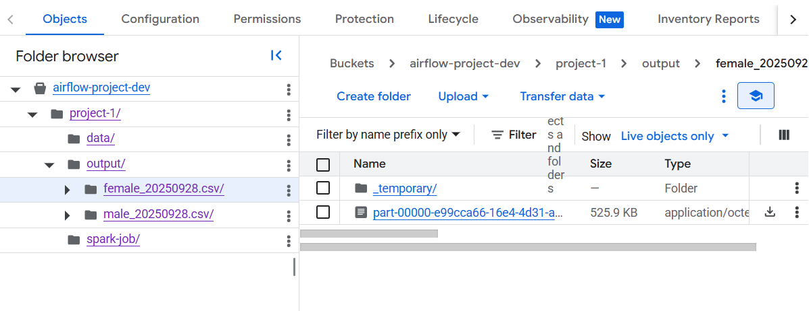
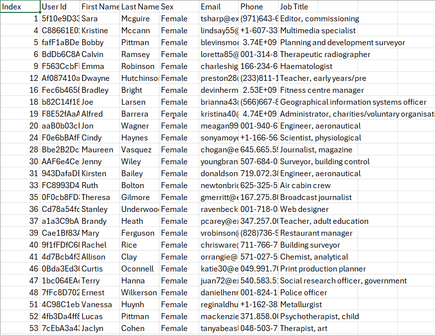
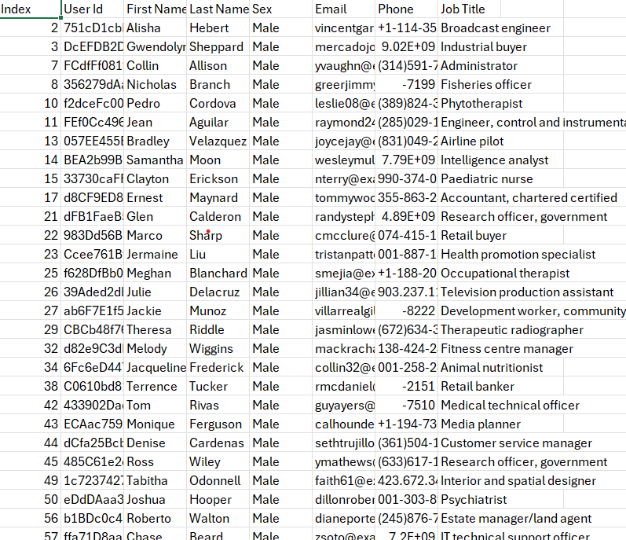

# Dynamic GCS-Triggered PySpark Processing with Airflow

### Description
This project implements an Apache Airflow pipeline that automates the processing of daily customer data stored in Google Cloud Storage (GCS). When triggered the pipeline first takes input the date to pick the right file to process (the date can be either passed explicitly as a parameter or defaulting to the DAG’s logical date). It then uses a GCS file sensor to detect the arrival of the corresponding file. (people_<yyyymmdd>.csv). Once the file is available, the workflow triggers a PySpark job on an existing Dataproc cluster to filter and transform the data, splitting it into male and female datasets and storing the results back into GCS. This pipeline ensures that data processing is both event-driven and parameterized, enabling flexible backfills and robust daily automation.

## Tech Stack & Tools Used

1. Apache Airflow
    - DAG orchestration
    - PythonOperator for dynamic parameter handling
    - GCSObjectExistenceSensor for event-driven workflow
    - XComs (Airflow feature), passing execution date dynamically between tasks

2. Google Cloud Platform (GCP)

    - Google Cloud Storage (GCS): Input/output data storage
    - Dataproc: Running PySpark jobs

3. PySpark
    - Data processing logic (filtering male/female records)
    - Input/output handling with CSV files

5. File-based Triggering

    - Automatic job execution when the expected file (people_<yyyymmdd>.csv) arrives in GCS
  
### Cluster used

This existing cluster was used to run the pyspark job.

**To use the cluster I used variables in airflow which contained cluster details. The details are self explanatory.**

Now we will take a look at how i have maintained the hierarchy in gcp bucket.

The **spark-job** directory has the [transformation.py](transformation.py) file inside.
The **data** directory has the [people_<yyyymmdd>.csv](https://drive.google.com/uc?id=1OT84-j5J5z2tHoUvikJtoJFInWmlyYzY&export=download) in it. This file was download and renamed to people_20250928
And the output file is where the data filtered on gender will be written to.

The [airflow_job.py](airflow_job.py) file is upload to the dag folder inside airflow cluster.

**On triggering first we need to give the date as input. Based on the date corresponding csv file will be chosen. Our file was named people_20250928.**

After that it will move on to the second task and wait for the file to be uploaded. Here we are using **GCSObjectExistenceSensor** to check for the file. It is configured to **poke every 30 seconds for 5 minutes straight**.

After the job has finished succesfully when we look at our gcp bucket we will see the male and female files.

If we download and open the files. In the female file we see all Sex as Female

In the male file we se all Sex as Male

This was a small project to practise my **PysparkJob Orchestration** for **Data Engineering**.

If you want to see the full video of the code working click here -> [LinkedIn]()

